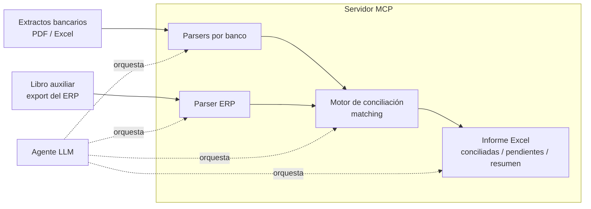

# conciliacion-mcp

> Servidor **MCP (Model Context Protocol)** que permite a un agente LLM conciliar movimientos bancarios contra el libro auxiliar de un ERP, de forma trazable y auditable.


> ⚠️ **Datos de ejemplo.** Este repositorio es público y usa **datos ficticios**. No contiene información bancaria ni contable real.

---

## El problema

La conciliación bancaria mensual suele hacerse a mano: alguien cruza, fila por fila, el extracto de cada banco contra el *libro auxiliar de bancos* del ERP, buscando partidas que cuadren y marcando las que no (cheques en tránsito, notas crédito/débito, comisiones, el GMF…). Es lento, repetitivo y propenso a errores.

`conciliacion-mcp` convierte ese proceso en un conjunto de **herramientas que un agente LLM puede orquestar**: el agente lee los archivos, ejecuta el emparejamiento y genera el informe, mientras la lógica determinista (parseo y matching) vive en código fiable y verificable.

---

## Cómo funciona

El servidor expone herramientas a un cliente compatible con MCP (p. ej. Claude). El agente las encadena para ir del archivo crudo al informe final:



El agente aporta el lenguaje natural ("concilia el mes de mayo de Bancolombia") y el criterio para resolver casos dudosos; el servidor aporta el determinismo: los números los cuadra el código, no el modelo.

---

## Herramientas del servidor

<!-- Ajusta los nombres a los de tu implementación real -->

| Herramienta | Qué hace |
|---|---|
| `parse_extracto_bancolombia` | Normaliza el extracto de Bancolombia (Excel) a un esquema común de movimientos. |
| `parse_extracto_bbva` | Igual para BBVA Colombia. |
| `parse_extracto_banco_agrario` | Igual para Banco Agrario (PDF de formato irregular — el parser más complejo). |
| `parse_libro_auxiliar` | Normaliza la exportación del libro auxiliar de bancos del ERP. |
| `conciliar` | Empareja extracto ↔ libro auxiliar y clasifica cada partida. |
| `generar_reporte` | Produce el informe Excel con el resultado. |

### Estrategia de emparejamiento

El motor de conciliación intenta cuadrar partidas en varias pasadas, de más a menos estricta:

1. **Exacta** — misma fecha e importe.
2. **Tolerante** — mismo importe con ±1 día de diferencia (desfases de valor).
3. **Por referencia** — número de comprobante / referencia cuando está disponible.

Cada movimiento queda etiquetado como *conciliado*, *solo en banco* o *solo en ERP*, contemplando casos típicos como cheques en tránsito, notas crédito/débito (NC/ND) y el gravamen al movimiento financiero (GMF).

### Informe de salida

El Excel resultante separa el resultado en pestañas:

- **Conciliadas** — partidas que cuadran en ambos lados.
- **Solo en banco** — están en el extracto pero no en el ERP.
- **Solo en ERP** — están en el libro auxiliar pero no en el banco.
- **Resumen** — totales, saldos y diferencias.

<!-- Ajusta las pestañas a las de tu reporte real -->

---

## Stack

- **Python 3.11+**
- **MCP** (Model Context Protocol) — transporte `stdio` para uso local
- Parseo de **Excel y PDF**
- Generación de informes en **Excel**

---

## Uso

Registra el servidor en tu cliente MCP. Ejemplo para Claude Desktop (`claude_desktop_config.json`):

```json
{
  "mcpServers": {
    "conciliacion": {
      "command": "python",
      "args": ["-m", "conciliacion_mcp"]
    }
  }
}
```

<!-- Ajusta command/args a cómo arranque tu servidor -->

Una vez conectado, puedes pedirle al agente cosas como:

> *"Concilia el extracto de Bancolombia de `mayo.xlsx` contra el libro auxiliar `aux_mayo.csv` y genérame el informe."*

---

## Por qué lo construí

Es un proyecto real nacido de una necesidad real, y a la vez mi laboratorio para llevar **IA agéntica a un flujo de negocio crítico** en lugar de a una demo. Me interesaba el reto de combinar lo mejor de dos mundos: el razonamiento flexible de un LLM con la fiabilidad de un motor determinista, expuesto a través de MCP.

---

## Autor

**Sebastián Sánchez Polanco** — product builder full-stack · IA aplicada
🔗 [github.com/sebastiansanchezpolanco](https://github.com/sebastiansanchezpolanco) · 📫 sebastiansanchezpolanco@gmail.com
